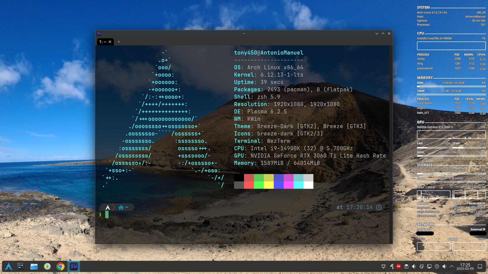

# **AutoArchInstaller**

## About AutoArchInstaller

This project consists of a set of initial commands, that must be typed one by one, and three installation scripts that run the necessary commands to automate a complete Arch Linux installation. I have spent a large amount of time searching for and also deciding which were the best programs to perform different tasks according to my needs and I have automated their installation with the scripts.<br />
Each user is different, some are looking for extreme efficiency, others for a nice-looking interface, privacy-focused programs, etc. Therefore, maybe your needs are different than mine, and to fit them you would need to install other programs. In that case, feel free to modify the scripts to install the most suitable software for you.

I have always been attracted by the GNU/Linux operating system and the Free and Open-Source Software in general because of several reasons:

- Better and more secure design than other operating systems in the marketplace.

- Open-source and more secure software since the code is continuously being analyzed by the community.

- The possiblity of automating many different kind of tasks.

- Know exactly what my operating system is doing internally.

- "Free" of spyware. This is not always the case since some distributions such as Fedora have recently introduced built-in telemetry.

- Less malware.

- Many development and hacking tools available.

- Highly customizable options.

However, what I never liked about the GNU/Linux operating system, when I tried the first typical distributions (Ubuntu, Mint and Kali) was the interface. In my humble opinion, the community hasn't worked enough on this aspect, and Windows and Mac operating systems have this feature more developed. Then, I investigated how to customize the operating system in a way that fitted my needs. Firstly, I started searching for the best Desktop Environments to personalize an already built GNU/Linux distribution that I would choose such as Ubuntu or Kali, and after some time I discovered the Arch distribution.

What firstly catched my eye was that this OS is not like the other ones that I ever tried. When you first turn your machine on and enter into the intallation media, a terminal prompt is shown waiting for commands to be typed. That means you have the freedom to install each single software that you want to use on your computer from the very first moment. Additionally, the rolling-release update method is also a brilliant aspect, not only from a new features perspective but also from a security perspective, because it allows you to upgrade each package to the last version typing one single command. This is something that in other distros such as Debian or Ubuntu is not present.

I am a Computer Science Engineer specialized in Cybersecurity and the Arch Linux operating system is simply perfect for me. Therefore, I decided to automate as much as possible its installation to have the possibility of installing it quickly on new computers or on virtual machines for testing and learning purposes. If you are a curious person like me and want to know more about GNU/Linux or how an operating system works in general, then I encourage you to run the commands of the scripts and also customize them. I have learned a lot and the process has been pretty fun.

The websites from which I started reading about Arch Linux were [The Arch Linux Wiki](https://wiki.archlinux.org/) and [The Arch Linux Handbook - Learn Arch Linux for Beginners](https://www.freecodecamp.org/news/how-to-install-arch-linux/). They are extremely useful and many of the first set of commands and the commands of the base-install script are very similar to the ones published there.

The image below shows the final appearance of my customized Arch Linux installation.



I hope that you find this project useful and also that you enjoy customizing the installation process as much as I have.


NOTES:
- Make sure UEFI mode is enabled.
- `wlanX`, `wifi_name` and `/dev/sdX` are just generic names in order not to confuse you. Use the correct names depending on your hardware.
- It is recommended to use the Long Term Support (LTS) kernel version instead of the Stable one. Sometimes, I have experienced issues after upgrading with some applications such as VMware because of the kernel version.
- Use X11 and bridge network connection options for VM installation.
- Read carefully the comments in the scripts. They show useful information on how to use them to log their output and their errors to different files and also what certain commands do and the reasons for their presence.
- Search for all types of possible errors in the log files to solve them after running the scripts.
    - Useful keywords: error, failed to build, etc.
- Initialize the data at the beginning of the scripts before you run them.
- It can take around 3 hours for the software-install script to be completed. When approximately 2 hours are elapsed it will ask you to confirm some install options (the Foxit Reader installation wizard and the addition of the Spanish DNIe security device).
- The first usage on the software-install script allows you to log both the standard and the error output to a single file, while the second usage allows you to log each output to a different file.
- Shared folders will be located in /mnt/hgfs directory.
- The troubleshooting-install script must be run after a restart, otherwise it won't work.


## Commands to be run

```shell script
setfont ter-128b                                                                                    #Set font

loadkeys es                                                                                         #Set keyboard layout

ls /sys/firmware/efi/efivars                                                                        #Verify efi mode

###############In case we have a wireless connection
iwctl                                                                                               #Start an interactive prompt

device list                                                                                         #See the list of available wireless adapters

station wlanX get-networks                                                                          #Print out a list of all the nearby networks

station wlanX connect wifi_name                                                                     #Connect to the wifi_name network

exit
###############In case we have a wireless connection

timedatectl set-ntp true                                                                            #Update the system clock

fdisk -l                                                                                            #List all the partition tables of every device connected to the system

fdisk /dev/sdX -l                                                                                   #List all the partitions of sdX device

cfdisk /dev/sdX                                                                                     #Start the program to create new partitions

fdisk /dev/sdX -l                                                                                   #Take a look at the recently created partitions

mkfs.fat -F32 /dev/sdX1                                                                             #Format the EFI partition

mkfs.ext4 /dev/sdX2                                                                                 #Format the EXT4 partition (root)

mkfs.ext4 /dev/sdX3                                                                                 #Format the EXT4 partition (home)

mkswap /dev/sdX4                                                                                    #Format the swap partition

mount /dev/sdX2 /mnt                                                                                #Mount the root partition

mkdir /mnt/home && mount /dev/sdX3 /mnt/home                                                        #Create the home directory and mount the home partition

swapon /dev/sdX4                                                                                    #Tell Linux to use this partition as swap explicity

cp /etc/pacman.d/mirrorlist /etc/pacman.d/mirrorlist.bak                                            #Make a backup of the default mirror list

reflector --country ES,PT,FR,GB,DE --age 12 --protocol https                                        #List mirrors that were synchronized within the last 12 hours located in close countries.

reflector --country ES,PT,FR,GB,DE --age 12 --protocol https --save /etc/pacman.d/mirrorlist        #Update the default mirror list

pacman -Syy                                                                                         #Update the package cache according to the new mirror list

pacstrap /mnt base base-devel linux linux-headers linux-lts linux-lts-headers linux-firmware sudo nano vim ntfs-3g networkmanager git wget zsh wezterm dolphin        #Install the Arch Linux system with a few useful tools

genfstab -U /mnt >> /mnt/etc/fstab                                                                  #Generate the fstab file

arch-chroot /mnt                                                                                    #Login to the newly installed system

cd tmp

git clone https://github.com/Tony450/AutoArchInstaller

cd AutoArchInstaller

chmod +x base-install.sh

./base-install.sh |& tee base-install.log

exit                                                                                                #Come out of the Arch-Chroot environment

umount -R /mnt                                                                                      #Unmount the partitions

reboot                                                                                              #Reboot the machine

cd Downloads

git clone https://github.com/Tony450/AutoArchInstaller

cd AutoArchInstaller

chmod +x software-install.sh troubleshooting-install.log

./software-install.sh > >(tee software-install-stdout.log) 2> >(tee software-install-stderr.log >&2)

reboot

./troubleshooting-install.sh |& tee troubleshooting-install.log

```

## License

Copyright (C) 2024 Antonio Manuel Hernández De León.

Licensed under the [GPL license](LICENSE.txt).

Conky theme made by [jxai](https://github.com/jxai) from https://github.com/jxai/lean-conky-config.


